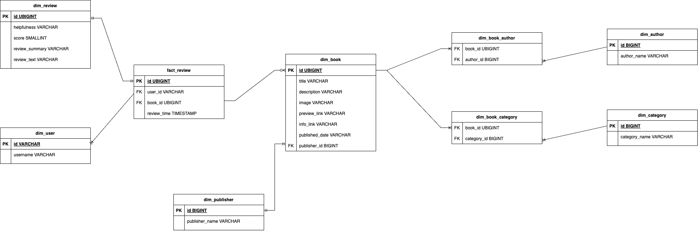

# duckdb_dbt_azure

- [About The Project](#about-the-project)
- [Context](#context)
- [Prerequisites](#prerequisites)
- [Release](#release)
- [Usage](#usage)

## About The Project

Template Project for Batch Processing with DBT and DuckDB on Azure
This template provides a streamlined setup for executing batch data processing using DBT and DuckDB within an Azure environment.
Paired with this infrastructure [repository](https://github.com/VictorMeyer77/duckdb-dbt-azure-infra), it offers a complete, end-to-end solution to run low-cost, production-ready batch pipelines in the cloud.

## Context

This project processes the Amazon Books Reviews dataset from [Kaggle](https://www.kaggle.com/datasets/mohamedbakhet/amazon-books-reviews) using a medallion architecture.
The data flows through bronze, silver, and gold layers, with the gold layer structured according to a star schema, as outlined below.

## Prerequisites

Once the infrastructure is set up, create a _books_ folder inside the _raw_ container in your Azure Storage account. Then, upload the following files into that folder:

* books_rating.csv
* books_data.csv

## Release

The Continuous Deployment (CD) pipeline automates the release of the project to Azure. The deployment consists of three main steps:

1. Build and Push Docker Image

    A Docker image of the project is built and pushed to the Azure Container Registry (ACR).

2. Deploy Azure Container Instance (ACI)

    An Azure Container Instance is created using the image from ACR.

3. Assign Permissions to Azure Automation

    The "Contributor" role is granted to the Azure Automation account on the ACI to allow it to manage and trigger executions.

## Usage

You can launch the batch process using Azure Data Factory, Azure Automation, or directly via the Azure Container Instance (ACI).